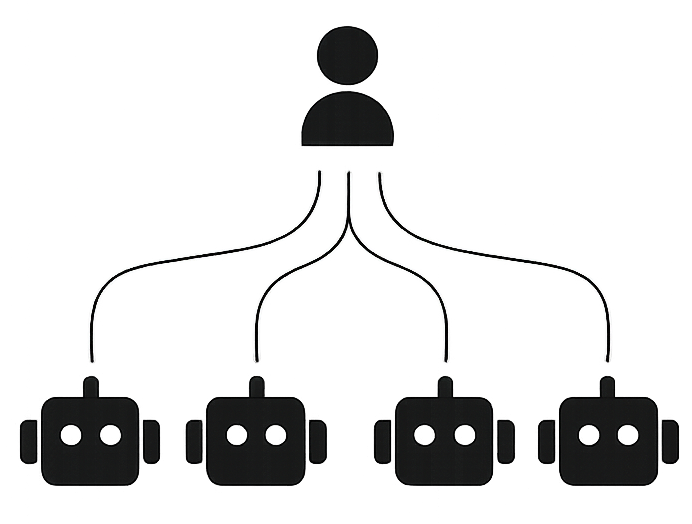

<p align="center">
  <picture>
    <source media="(prefers-color-scheme: dark)" srcset="./pi-symbol-dark.svg" />
    <source media="(prefers-color-scheme: light)" srcset="./pi-symbol-light.svg" />
    
  </picture>
</p>

<p align="center"><b>Pi Dash -- AIエージェントオーケストレーションプラットフォーム</b></p>

<p align="center">
    <a href="https://pidash.airepublic.com"><b>Live</b></a> •
    <a href="https://airepublic.com/"><b>Website</b></a> •
    <a href="https://airepublic.com/docs"><b>Documentation</b></a> •
    <a href="https://airepublic.com/"><b>Community</b></a> •
    <a href="https://x.com/ai_republic"><b>X</b></a>
</p>

<p align="center">
    <a href="./README.md"><b>English</b></a> •
    <a href="./README.zh-CN.md"><b>简体中文</b></a> •
    <b>日本語</b> •
    <a href="./README.pt-BR.md"><b>Português (BR)</b></a> •
    <a href="./README.es.md"><b>Español</b></a> •
    <a href="./README.ko.md"><b>한국어</b></a>
</p>

Pi Dash は、**As Coding（非同期バイブコーディング）** のために構築されたオープンソースの AI エージェントオーケストレーションプラットフォームです。これは、何を構築すべきかを定義すれば、コーディングエージェントがバックグラウンドで実装を処理してくれるワークフローです。エージェントの実行を見守ったり、スクロールするターミナルを眺めたりする代わりに、Pi Dash を使えば本当に重要な作業、すなわちタスクのスコープ設定、結果のレビュー、プロダクトの出荷に集中できます。

**[pidash.airepublic.com](https://pidash.airepublic.com)** で今すぐお試しください。インストールは不要です。

> Pi Dash は日々進化しています。皆さまからの提案、アイデア、バグ報告は私たちにとって大きな助けとなります。お気軽に [GitHub ディスカッション](https://github.com/The-AI-Republic/pi-dash/discussions)を開いたり、[Issue を起票](https://github.com/The-AI-Republic/pi-dash/issues)したりしてください。私たちはすべてに目を通し、ほとんどに返信しています。

## 🌟 アーキテクチャ

Pi Dash は 3 つの主要コンポーネントで構成されています。

<p align="center">
  <picture>
    <source media="(prefers-color-scheme: dark)" srcset="./images/pidash_diagram_white.png" />
    <source media="(prefers-color-scheme: light)" srcset="./images/pidash_diagram_black.png" />
    
  </picture>
</p>

### Pi Dash Platform

プロジェクトを管理し、タスクを定義し、エージェントの進捗を監視するための Web ベースのオーケストレーションハブです。作業項目を作成し、サイクルやモジュールに整理し、エージェントの出力をレビューし、分析を追跡する。これらすべてを単一のダッシュボードから行えます。ここが、ターミナルを眺める代わりに時間を費やす場所です。

### Pi Dash CLI & Runner Daemon

開発マシン上で動作するローカルのコマンドラインツールとバックグラウンドデーモンです。CLI は Pi Dash プラットフォームに接続し、割り当てられたタスクを受け取り、設定された AI エージェントにディスパッチし、結果を報告します。runner デーモンはこのループを継続的に回し続けるため、各タスクを手動でトリガーする必要はありません。

### AI Agent（ユーザー提供）

Pi Dash はエージェント非依存であり、お好みのコーディングエージェントを持ち込めます。現在、runner は **Claude Code** と **Codex** をファーストクラスでサポートしています。ディスパッチ層は、オーケストレーションモデルを変更することなく追加のエージェントを組み込めるように設計されています。runner が呼び出すエージェントを設定すれば、残りは Pi Dash が処理します。

## 🚀 インストール

> **Pi Dash Cloud** が **[pidash.airepublic.com](https://pidash.airepublic.com)** で公開されました。サインアップすれば、自身のインフラを運用することなく始められます。セルフホストをご希望ですか？以下の手順に従ってください。

### 1. Pi Dash Platform（セルフホスト）

#### 要件

- Docker Engine がインストールされ、稼働していること
- Node.js バージョン 22 以上 [LTS バージョン](https://nodejs.org/en/about/previous-releases)
- Python バージョン 3.12 以上
- Postgres バージョン v15 以上
- Valkey v7 以上（または Redis 7 以上、ドロップイン互換）
- **メモリ**: 最低 **12 GB RAM** を推奨
  > RAM が 8 GB しかないシステムでプロジェクトを実行すると、セットアップの失敗やメモリクラッシュ（特に Docker コンテナのビルド/起動時や依存関係のインストール時）につながる可能性があります。GitHub Codespaces などのクラウド環境を使用するか、可能であればローカルの RAM を増設してください。

#### セットアップ

1. リポジトリをクローンする

```bash
git clone https://github.com/The-AI-Republic/pi-dash.git [folder-name]
cd [folder-name]
chmod +x setup.sh
```

2. setup.sh を実行する

```bash
./setup.sh
```

`setup.sh` は、すべての `.env.example` を対応する `.env` にコピーし（リポジトリのルートに加えて `apps/web`、`apps/api`、`apps/space`、`apps/admin`、`apps/live`）、一意の Django `SECRET_KEY` を生成して `apps/api/.env` に追記し、その後 `pnpm install` を実行します。デフォルトのループバック開発セットアップでは、`.env` ファイルを手動で編集する必要はありません。`.env.example` のデフォルト値（localhost の URL、`pi-dash` データベースの認証情報、ローカルの MinIO エンドポイントなど）はそのまま動作します。デフォルト以外のホスト/ポートにバインドする場合や、外部サービスを組み込む場合にのみ編集してください。

3. コンテナを起動する

```bash
docker compose -f docker-compose-local.yml up
```

4. Web アプリを起動する:

```bash
pnpm dev
```

5. ブラウザで http://localhost:3001/god-mode/ を開き、インスタンス管理者として自身を登録する
6. ブラウザで http://localhost:3000 を開き、同じ認証情報でログインする

#### 本番デプロイ

実際のセルフホストデプロイ（ローカル開発ではない場合）では、どれだけ自分で管理したいかに応じて適した方法を選んでください。

- **[オールインワン Docker イメージ](./deployments/aio/community/README.md)** — すべての Pi Dash サービスをバンドルし、内部で `supervisord` によって管理される単一コンテナ。最もシンプルな方法で、単一の `docker run` コマンドで済みます。デモ、ホームラボ環境、評価、小規模チームに最適です。外部の Postgres / Redis / RabbitMQ / S3 互換ストレージは引き続き必要です。
- **[Docker Compose / Swarm によるセルフホスト](./deployments/cli/community/README.md)** — フルのマイクロサービススタック（6 つのサービスコンテナ + データベース + キュー + ストレージ）。設定は多くなりますが、サービスごとに独立したスケーリングとローリングアップデートが可能です。評価目的を超えるあらゆる用途に推奨します。
- **Kubernetes / Helm** — Helm チャートの公開は計画中ですが、まだ提供されていません。[`deployments/kubernetes/community/README.md`](./deployments/kubernetes/community/README.md) を参照してください。

### 2. Pi Dash CLI & Runner Daemon

エージェントにタスクを受け取らせて実行させたい任意のマシンに CLI をインストールします。現在サポートされているプラットフォーム:

- **macOS** — Apple Silicon (arm64)
- **macOS** — Intel (x86_64)
- **Linux** — arm64 および x86_64
- **Windows** — x86_64

macOS および Linux では、開発マシンのターミナルで以下のコマンドを実行します:

```bash
curl --proto '=https' --tlsv1.2 -LsSf \
  https://github.com/The-AI-Republic/pi-dash/releases/latest/download/pidash-installer.sh | sh
```

Windows では、MSI インストーラーをダウンロードして実行します:

<https://github.com/The-AI-Republic/pi-dash/releases/latest/download/pidash-x86_64-pc-windows-msvc.msi>

特定のバージョンに固定する（またはプレリリースをインストールする）には、`latest` をタグに置き換えてください。例: `.../releases/download/pidash-v0.1.4/pidash-installer.sh`。プレリリースは `/latest/` から除外されているため、上記のワンライナーは常に最新の安定版リリースを提供します。完全な固定手順（ラッパー、素のインストーラー、Windows バリアント）は [`runner/README.md`](./runner/README.md#installing-a-specific-version-pinning--prereleases) に記載されています。

次に、マシンを認証して runner を登録します。標準的なフローは 2 つのコマンドです:

```bash
# 1. ブラウザベースの device-code ログイン（`gh auth login` / `stripe login` のような形式）。
#    CLI トークンを ~/.config/pidash/config.toml に保存します。
pidash auth login --url https://your-pidash-instance.com

# 2. このホストを runner として登録します。手順 1 のトークンを使用するため、
#    enrollment-token の貼り付けは不要です。最初の runner では OS サービス
#    （Linux では systemd ユーザーユニット、macOS では launchd エージェント、
#    Windows ではユーザーごとのスケジュールされたタスク）をインストールし、
#    デーモンを起動します。
pidash runner add --project <project-id>
```

`pidash auth login` は、まだ runner が存在しない場合にインラインで runner の追加を促すため、まっさらな開発用ラップトップを単一のコマンドでオンボーディングできます。後から `pidash runner add --project <other-project-id>` でさらに runner を追加できます。

runner デーモンはバックグラウンドで動作し、割り当てられたタスクをポーリングし、AI エージェントにディスパッチし、結果をプラットフォームに報告します。

便利なコマンド:

| コマンド        | 説明                                                                                                 |
| --------------- | ---------------------------------------------------------------------------------------------------- |
| `pidash status` | サービスとデーモンのステータスを表示する                                                             |
| `pidash tui`    | デーモンを監視するためのインタラクティブなターミナル UI を開く                                       |
| `pidash doctor` | プリフライトチェックを実行する（エージェントのインストール、git の設定、プラットフォームへの到達性） |
| `pidash stop`   | デーモンを停止する                                                                                   |

利用可能なすべてのコマンドについては `pidash --help` を参照してください。

### 3. AI Agent（ユーザー提供）

Pi Dash は AI エージェントを同梱していません。お好みのものを持ち込んでください。選択したエージェントの CLI が、Pi Dash CLI を実行するマシン上にインストールされ、アクセス可能であることを確認してください。runner は現在、2 種類のエージェントを標準でサポートしています:

- **Claude Code** — [`claude`](https://docs.anthropic.com/en/docs/claude-code) をインストールし、`claude --version` が動作することを確認してください。
- **Codex** — [`codex`](https://github.com/openai/codex) をインストールし、`codex --version` が動作することを確認してください。

`pidash doctor` は、本番稼働前に、設定されたエージェントが `PATH` 上にあること、およびクラウドに到達可能であることを検証します。

### 4. コーディングエージェント向け Pi Dash スキル（オプション）

[`pi-dash-skill`](https://github.com/The-AI-Republic/pi-dash-skill) は、ポータブルなエージェントスキルをパッケージ化したものです。これにより、Claude Code や Codex が `pidash` CLI を介して、コーディングセッションから直接 Pi Dash の Issue を作成、一覧表示、移動、検査できます。

```bash
npx @airepublic/pidash-skill-installer           # Claude Code、Codex、またはその両方にインストールします
```

インストーラーはターゲット（デフォルト: すべて）を尋ね、必要に応じて GitHub からスキルを取得します。クローンは不要です。プロンプトをスキップするには `--all`、`--claude-code`、または `--codex` を渡してください。

Codex ユーザーは、Codex セッション内から組み込みの `$skill-installer` を介してインストールすることもできます。環境変数のオーバーライド（`CLAUDE_HOME` / `CODEX_HOME`）、クローンベースのインストール方法、その他の代替手段については [pi-dash-skill README](https://github.com/The-AI-Republic/pi-dash-skill#readme) を参照してください。

## ⚙️ 使用技術

[](https://reactrouter.com/)
[](https://www.djangoproject.com/)
[](https://nodejs.org/en)

## 📝 ドキュメント

機能、セットアップ、使用方法について学ぶには、[Pi Dash ドキュメント](https://airepublic.com/docs)をご覧ください。

## ❤️ コミュニティ

[GitHub Discussions](https://github.com/The-AI-Republic/pi-dash/discussions) で会話に参加し、X で [@ai_republic](https://x.com/ai_republic) をフォローするか、最新情報については [airepublic.com](https://airepublic.com/) をご覧ください。私たちはすべてのコミュニティチャネルで[行動規範](./CODE_OF_CONDUCT.md)に従っています。

質問、バグ報告、ディスカッションへの参加、アイデアの共有、機能リクエスト、プロジェクトの紹介など、お気軽にどうぞ。皆さまからのご連絡をお待ちしています！

## 🛡️ セキュリティ

Pi Dash にセキュリティ脆弱性を発見した場合は、公開 Issue を作成するのではなく、責任を持って報告してください。詳細は [SECURITY.md](./SECURITY.md) を参照してください。

セキュリティ上の問題を開示するには、[privacy_security@airepublic.com](mailto:privacy_security@airepublic.com) までメールでご連絡ください。

## 🤝 コントリビューション

Pi Dash には多くの貢献方法があります:

- [バグ](https://github.com/The-AI-Republic/pi-dash/issues/new)を報告したり、機能リクエストを送信したりする。
- ドキュメントをレビューし、それを改善するためのプルリクエストを送信する。誤字の修正でも新しいコンテンツの追加でも構いません。
- [人気の機能リクエスト](https://github.com/The-AI-Republic/pi-dash/issues)に賛成票を投じて支持を示す。

プルリクエスト送信のプロセスの詳細については、[CONTRIBUTING.md](./CONTRIBUTING.md) をお読みください。

### 皆さまなしには成し得ませんでした。

<a href="https://github.com/The-AI-Republic/pi-dash/graphs/contributors">
  コミュニティのコントリビューターの皆さま
</a>

## 謝辞

Pi Dash は、オープンソースのプロジェクト管理ツールである [Plane](https://github.com/makeplane/plane) の上に構築されています。Pi Dash を可能にする基盤を築いてくれた Plane チームとそのコントリビューターの皆さまに感謝します。

## ライセンス

本プロジェクトは [GNU Affero General Public License v3.0](./LICENSE.txt) の下でライセンスされています。
